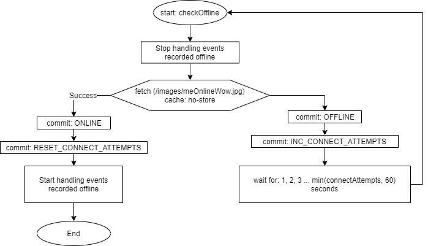

# Offline workflow

One of the core features of BearIT is to allow users work with the app even if the internet connection is down.
Thanks to PWA it is possible in first place. We are building the service worker on top of the workbox what makes
things a bit easier.

Let's think in what areas we need the offline implementation:

1) Assets, static views
2) Dynamic content

But before we get into this let's understand how we know we are offline.

## Offline state

* First of all we are listening to the offline and online event's. We can't really count on this but this is only
additional place we can fire our "offline checker" logic.
* Any fetch done by axios library thanks to it's response interceptor. When it's rejected the "offline checker"
is fired.
* On handling responses in axios with helper handler "requestHandler". When there is an error, and we get no response,
than we are rejecting the api call and adding `offline: true` property to the error object so we can add the offline
logic in the promise catch.

This is how the offline checker works:


We can easily get the offline state by using `assets/js/mixins/offline.js`
(`import offlineMixin from '~/mixins/offline'`) what is simply:
```
 computed: {
        ...mapState(['offline'])
    },
    methods: {
        ...mapActions(['checkOffline']),
        async putOfflineEvent(name, payload) {
            (await offlineStorage).put(new OfflineEvent(name, payload))
        }
    }
```

## OfflineStore

Offline store is where we will record things that user did when offline and we want to handle it when the user
is back online.

`~/lib/offlineStorage` provides us API for this task:

* `registerHandler(name, fn)` - registers handler for the event. Handler is a function what must return a promise
    what resolves to `true` if the event is handled or `false` when it's not. When handler did not resolve to true
    the event stays in the stream and will be handled in next run.
* `put(event)` - add event to the stream
* `startHandling` and `stopHandling` is used internally by store when the offline check is fired
* `addListener(name, fn)` - registers our listener
* `removeListener(name, fn)` - remove registered event
* `forEachEvent(fn)` iterate for each event in store and call fn(event)

Note: offlineStorage is a promise what resolves to object containing methods listed above. So to use it we do:
```
    import offlineStorage from `~/lib/offlineStorage`

    offlineStorage.then(storage => {
        storage.put(...)
    });

    //or
    (await offlineStorage).put(...)

    //or
    const storage = await offlineStorage
    storage.put(...)
    
```

```
    class OfflineEvent {
        constructor(name, payload) {
            this.id = uuid();
            this.name = name;
            this.payload = payload;
            this.date = Date.now();
        }
    }
```

OfflineStorage notifies about the following events:
 * `put` - fired after the event has been added to the stream
 * `remove` - fired after the event was removed from the stream. This i done when there is a handler for the event
    and this handler resolved to `true`.
 * `beforeHandle` - fired before executing handler for the event
 * `afterHandle` - fired after executing handler for the event and before removing it from the IndexDB

## Assets and static views

In case of this area we will be using mostly the browser cache and configure it in `assets/js/sw.js`.
Before going deeper into this it's recommended that you get familiar with the caching strategies what are
implemented in the workbox: [Workbox strategies][wb-strategies].

Basically we need to register routes for the resources with the appropriate strategy, mostly NetworkFirst or CacheFirst.
So when the user will access the registered routes it will be then accessible when no online connection.
When we want the user to have access to some resources even if he won't access it before then we can precache
the routes.

```
workbox.precaching.precacheAndRoute([
    '/the/route',
    '/the/asset.js',
    '/other/asset/like/image.jpg'
])
```

The bundles generated by webpack builds are already precached so we don't need to worry about this.

## Dynamic content

This topic is more challenging and I'll try to show you different scenarios how it can be implemented.

### Fetching content

Let's imagine we want to build a project list. Without the offline approach it will look like:


With offline ready approach we will change this a bit. When we successfully fetched the list from API.
We will process it to the format what it will be stored in cache. In this case we won't be using the browser cache.
Instead we will be using other browser feature -> IndexDB what is a simple key value store. If the fetch would fail
the list will be returned from the IndexDB.


So how to do this? We will be using strategy Network first, but not the one implemented by workbox. We will implement
it just like we need it. In the service worker (`assets/js/sw.js`)

```
workbox.routing.registerRoute(
    '/api/project/user-list',
    ({ event }) => {
        event.respondWith(
            fetch(event.request).then(res => {
                const clonedRes = res.clone()
                clonedRes.json().then(projectList => {
                    bearItDb.updateProjectList(projectList.data)
                })

                return res
            }).catch(() => {
                bearItDb.getProjectList()
            })
        )
    }
)
```

`bearItDb` is our object what wraps the idb library, what is promised API lib for the IndexDB. As this is in the
service worker it's outside the js sources location. It's located in server public folder `public/js/lib/db-utils.js`.

Note1: Adding own store, remember to add creating logic if it does not exist in the `db-utils.js`:

```
    const dbPromise = idb.openDB('bear-it-store', 1, {
        upgrade(db) {
            // ...
            if (!db.objectStoreNames.contains(Stores.PROJECTS)) {
                const store = db.createObjectStore(Stores.PROJECTS, {keyPath: 'id'})
                store.createIndex('version', 'version')
            }
            // ...
       }
    });
```

## Handling content change

This will be best described by an example. Let's assume we want to handle adding project in offline mode.
Having current only online version with for example:

`api.create(this.project.id, this.project.name, this.project.description)`

`api.create` is a function using axios post:
```
create(id, name, description) {
        return client.post('/api/project/create', {
            id,
            name,
            description
        }).then(requestHandler)
    }
```

Simple enough. So as we read previously, when the axios did not return the response that in the error object we
get the offline property with value true.

```
api.create(id, name, description)
    .catch(error => {
        if (error.offline || false) {
            // Our offline logic
        }
    })
```

or with `async/await:

```
try {
    await api.create(id, name, description)
} catch(error) {
    if (error.offline || false) {
        // Our offline logic
    }
}
```

Let's record that user wanted to create the project. If we do this in Vue component we can use mixin to put event
by name and payload. But let's assume we are not doing this in component.

```
import offlineStorage, { OfflineEvent } from  `~/lib/offlineStorage`

try {
    await api.create(this.project.id, this.project.name, this.project.description)
} catch(error) {
    if (error.offline || false) {
        (await offlineStorage).put(new OfflineEvent('project_create', {id, name, description})
    }
}
```

This is one side of the barricade. Now we have to handle this event when the user comes online.
To do this we have to register handler.

1) There is a folder `assets/js/offlineHandlers`, and index.js is imported by the `app.js` entry point. So this is good
    place to import our offline handler.
    
    ```
    import './project/create'
    ```

2) Now implementation of our handler:

    ```
    import offlineStorage from '../../lib/offlineStorage'
    import api from '@api/project'
    
    offlineStorage.then(eventStore => {
        eventStore.registerHandler('project_create', async (event) => {
            const {id, name, description} = event.payload
            try {
                await api.create(id, name, description);
            } catch() {
                return false;
            }
   
            return true;
        });
    })
    ```
 
Looks done? Yes and No. So if the request fail it won't be removed from the event stream and that is what we expect
in all cases when the fault of request fail is the server. But when the problem is on user side i.e. he did not seen 
in the crystal ball that some one will add the same project. Now user has the validation error and our offline storage
is trying to push it all the time.

If we think hard enough we can see that this situation is not the same as when user was creating his project.
So this is other event. The things we should do here is say yes we handled the event but there other appeared,
so handle this you little bastard! In the computer language:

```
import offlineStorage, { OfflineEvent } from '../../lib/offlineStorage'
    import api from '@api/project'
    
    offlineStorage.then(eventStore => {
        eventStore.registerHandler('project_create', async (event) => {
            const {id, name, description} = event.payload
            try {
                await api.create(id, name, description);
            } catch(error) {
                // this is not a validation error, try better next time
                if (!error.response || !error.response.data || error.response.data.status !== 'ERROR_VALIDATION') {
                    return false;
                }

                const data = error.response.data;
                const payload = event.payload;
                payload.errors = data.errors;
                eventStore.put(new OfflineEvent('project_create_conflict', payload));
            }
   
            return true;
        });
    })
```

Following the story, when the user resolves his conflicts we can try to call and handle the same way creating api.

We can also solve this issue by not adding new event but storing this in other IndexDB storage. The previous one has
the advantage that we don't have to create another storage, but we have to add handler for the event.

Let's see how we can benefit from the additional event approach -> adding a sync table what tells user that this is not
sync yet or it had conflicts he has to resolve.

First let's create an vuex store module where we will have a list of created projects in offline mode. The state
will contain all data we want to display of the project, the sync status and the errors if any.

```
import offlineStorage from '~/lib/offlineStorage'

export default {
    namespaced: true,
    state: {
        createdProjects: []
    },
    mutations: {
        ADD_CREATED_PROJECT(state, {id, name, description}) {
            state.createdProjects.push({
                id,
                name,
                description,
                sync: false,
                errors: false
            })
        },
        ADD_SYNC_ERROR_PROJECT(state, {id, name, description, errors}) {
            state.createdProjects.push({
                id,
                name,
                description,
                sync: false,
                errors
            })
        },
        REMOVE_PROJECT(state, id) {
            const index = state.createdProjects.findIndex(project => project.id === id)
            if (index >= 0) {
                state.createdProjects.splice(index, 1)
            }
        },
        RESET_STATE(state) {
            state.createdProjects = []
        },
        SYNC_PROJECT(state, {id, syncState}) {
            const project = state.createdProjects.find(project => project.id === id)
            if (project) {
                project.sync = syncState
            }
        }
    },
    actions: {
        async init({commit}) {
            commit('RESET_STATE');
            const onPut = event => {
                if (event.name === 'project_create') {
                    commit('ADD_CREATED_PROJECT', event.payload)
                } else if (event.name === 'project_create_sync_error') {
                    commit('ADD_SYNC_ERROR_PROJECT', event.payload)
                }
            }

            const onRemove = event => {
                if (['project_create', 'project_create_sync_error'].includes(event.name)) {
                    commit('REMOVE_PROJECT', event.payload.id)
                }
            }

            const storage = await offlineStorage;

            storage.addListener('put', onPut)
            storage.forEachEvent(onPut)
            storage.addListener('remove', onRemove)
            storage.addListener('beforeHandle', event => {
                if (event.name === 'project_create') {
                    commit('SYNC_PROJECT', {id: event.payload.id, syncState: true})
                }
            })
            storage.addListener('afterHandle', event => {
                if (event.name === 'project_create') {
                    commit('SYNC_PROJECT', {id: event.payload.id, syncState: false})
                }
            })
        }
    }
}
```

The most interesting part is the init action. It will be called after the store is created:
```
const store = new Vuex.Store(storeOptions);

(async function () {
  await store.dispatch('offlineProjects/init')
})()
```

To be sure we don't have duplicates, we are resetting state. Then we add
* listener for `put` event, to catch all new added projects when offline,
* listener for `remove` event, to remove from list when the events we are interested in are removed,
* listener `beforeHanlde` to change status that the sync is in progress.
* listener `afterHanlde` to change status that the sync has stopped.

[wb-strategies]: (https://developers.google.com/web/tools/workbox/modules/workbox-strategies).
